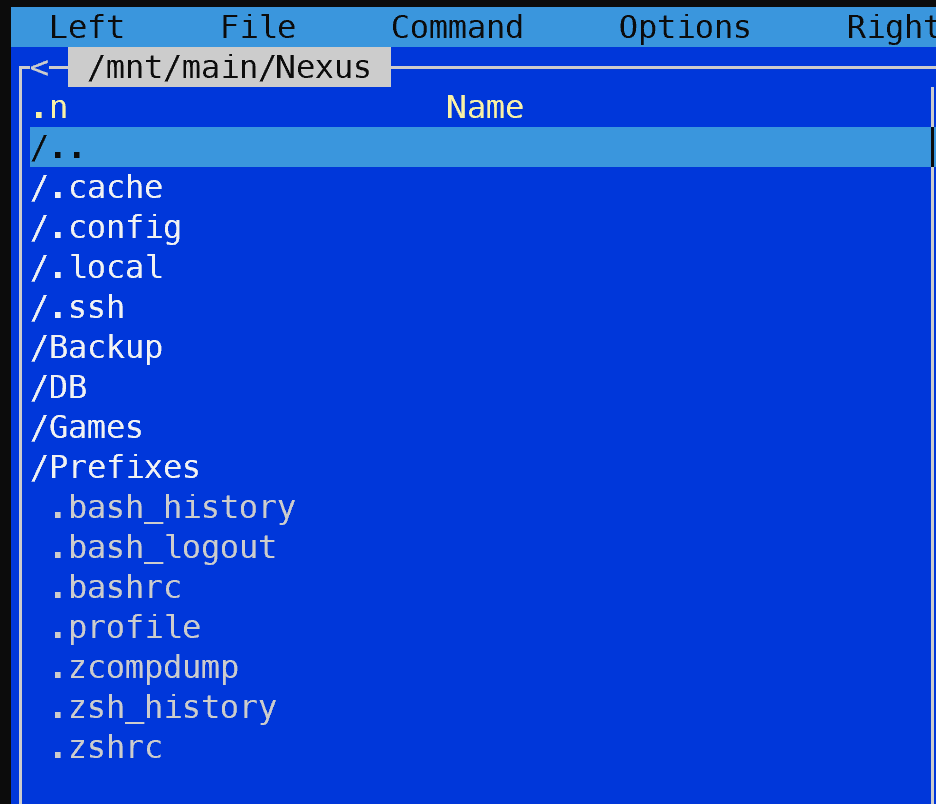

# Nexus


It's Game Manager for Steam that serves as a middleman between Steam and your NAS.

It was initially built for Steam Deck, but it can be used on any Linux machine.

(and with small adjustments it can be used on any other platform, just need to update the target platform configs)

## Note

It's a POC, that is built for personal use.

But it's being actively used by me and my family members.

### Assumptions

This project is tightly coupled with [PortProton](https://github.com/Castro-Fidel/PortWINE)

It also assumes that [EmuDeck](https://github.com/dragoonDorise/EmuDeck) is used for Emulation

For the Switch emulation, it assumes Citron and Ryujinx are being used

## Background

Steam is a well built Game manager and it works great with Steam native game library.

You download a game from Steam, play it, delete the game when you need to free up space.

And next time you want to play the game, you simply download it again from Steam and play it.

All your save and progress are being stored by Steam.

But, it's completely different when you have your own collection of games:

- DLR free games
- ISO images of your legally dumped PS2/PS3 games
- So called abandonware - games that are not available to purchase and completely abandoned
- MODS and different custom versions of the same game

All those games you can add to your Steam as "Non-Steam Game".

But, Steam Deck has a quite limited storage capacity, and if you want to play something new, you need to free up space.

Potentially, losing your progress. And next time you want to play the game, you need to install it and configure again.

But, what if there is a NAS where you could keep all your personal games, saves and configurations?

This how Nexus was born.

## Requirements

Minimal dependencies, only NAS is required. NAS in this case is any server with SSH access using private key authentication.

Supports several steam accounts but provides a shared library for all of them.

Anyone who has access to Nexus and NAS is able to add a game to the library and sync it with the NAS.

No database server is required. Only file storage is needed.

Supports auto-update.

Cross-platform.

Supports configs backup.

It should make a Steam shortcuts backup before making any modifications.

## Flow

Here is the flow of how Nexus supposed to be user:

1. Configure your NAS (any server with SSH access would work)

   - create a user and configure SSH access using a private key
   - optionally install Tailscale

2. [Download and install Nexus](#installation)

   - switch to the Desktop Mode on your Steam Deck
   - download and install Nexus

3. Configure Nexus

   - put the private key to your Steam Deck
   - optionally install Tailscale on Deck
   - run Nexus and configure it

4. Install a game as usual
5. Add game to Steam
6. Launch Nexus and find your game
7. Configure game and save it to your NAS

After that, you can delete the game but the it will be available on your NAS,

so you can download it again every time you want to play it.

Your friends and family members can use the same NAS to store and download games.

## Features

- Sync up/down your games with your NAS
- Backup your saves/configs/progress
- Steam shortcut update
- Auto-update
- No external dependencies like a database, only NAS is required
- Per user namespaces for saves/configs/progress

## Installation

1. Download the latest release from [releases](https://github.com/hardjonn/nexus/releases)
2. Rename app to `Nexus.AppImage`
3. Move it to `/home/deck/Applications`
4. (Optional) Launch, go to the `About -> Integration` section and `Add/Update Desktop Entry` to create a desktop shortcut

## Configuration

### NAS

#### TrueNAS Scale Example

1. Create a Dataset with Compression Level: `ZSTD-11` (it's a good balance between speed and compression)


2. Generate a key, we will need on the next step

I'm using WSL2, but the NAS shell will also work

```bash
$ ssh-keygen -t ed25519 -C "nexus@truenas.scale"
```

leave the passphrase empty


3. Create a user on your NAS: `Credentials -> Local Users -> Add`

Feel free to tweak the settings as you like, but here are the ones I used:

    - Full name: `Nexus`
    - username: `nexus`
    - Disable password: `checked`
    - User ID: `100x`
    - Create a new Primary Group: `checked`
    - Home Directory: `/mnt/main/Nexus` <- Path to your dataset
    - Authorized Keys: `ssh-ed25519 AAAAC3NzaC1lZDI1NTE5AAAAI...` <- paste your public key here from the previous step
    - Home directory permissions: `0755`
    - Shell: `bash`


4. Copy the private key to your Steam Deck

   - location: `/home/deck/.ssh/nexus_nas_deck`
   - permissions: `0600`

Eventually, the home directory will look something like this:



### Nexus

Launch the Nexus app and go to the Config section

#### Config Location

The config is stored in

    - `~/.config/Nexus/config.json`
    - `~/.config/Nexus/app.state.json`

#### Steam Settings

1. Steam User ID:

   - open Steam, go to `Steam` -> `Settings` -> `Account` -> `Friend Code`
   - alternatively, go to `/home/deck/.steam/steam/userdata/` and find the folder with your Steam User ID

2. Steam User Name:

   - put your Steam User Name here

3. User Config Path:

   - it's a base path to the Steam user data: `/home/deck/.steam/steam/userdata`

4. Steam Shortcuts File Name:

   - it's a name of the file that contains the shortcuts: `shortcuts.vdf`

5. Steam Shortcuts Full Path Ref

   - it's a full path to the shortcuts file and is auto-generated based on the User Config Path and Steam Shortcuts File Name


#### Remote Settings

1. Remote Host:

   - it's a remote host where your NAS is located, for example: `192.168.1.100`

2. Remote User (SSH):

   - it's a remote user that has access to your NAS - `nexus`

3. Remote Private Key Path (SSH):

   - path to the private key that you created while configuring the NAS
     - location:`/home/deck/.ssh/nexus_nas_deck`
     - note: make sure to change the permissions to `0600`

4. Remote Games Path:

   - it's a path where all the games will be stored on your NAS: `/mnt/main/Nexus/Games` (home directory of the `nexus` user)

5. Remote Prefixes Path:

   - it's a path where all the prefixes will be stored on your NAS: `/mnt/main/Nexus/Prefixes` (home directory of the `nexus` user)

6. Remote DB Path:

   - it's a path where DB json files will be stored on your NAS: `/mnt/main/Nexus/DB` (home directory of the `nexus` user)

7. Remote Default Prefixes:

   - it's a name of the folder where the default prefixes will be stored: `default`


#### Local Settings

1. Local Prefixes Path:

   - it's a path where all the local prefixes are stored: `/home/deck/.var/app/ru.linux_gaming.PortProton/data/prefixes`

2. Port Proton Path

   - it's a base path of the PortProton installation: `/home/deck/.var/app/ru.linux_gaming.PortProton`

3. Local DB Path

   - it's a path where DB json files will be stored on your local machine: `/home/deck/Nexus/DB`

4. Local Games Lib Path
   - it's a list of game locations on the local machine (Steam Deck), for example if you have your internal SSD, SD Card and and External SSD
   - Label: `SSD`; Path: `/home/deck/Games`
   - Label: `SD1`; Path: `/run/media/deck/SD/Games`
   - Label: `ExtSSD`; Path: `/run/media/deck/ExtSSD/Games`


#### Emulation Settings

1. Emulation Path

   - it's a path where all the emulation related items are stored (EmuDeck): `/home/deck/Games/Emulation`

#### Backup Settings

1. Remote Location

   - it's a path where all the backup files will be stored on your NAS: `/mnt/main/Nexus/Backup` (home directory of the `nexus` user)

2. Local Backup Locations
   - Path - path to backup: `/home/deck/Games/Emulation/roms/ps2`
   - Exclude - exclude files, `;` separated: `*.iso;*.ISO`
   - Extra - any extra arguments to pass to `rsync`


## Development and Project Setup

### Stack

- [Electron](https://github.com/electron/electron)
- [Electron-Vite](https://github.com/alex8088/electron-vite)
- [Electron-Builder](https://www.electron.build/index.html)
- [Electron-Updater](https://www.electron.build/auto-update.html)
- [Vue](https://github.com/vuejs/vue)
- [TailwindCSS](https://github.com/tailwindcss/tailwindcss)
- [Flowbite](https://github.com/themesberg/flowbite)

### Dev

```bash
$ npm run dev
```

NOTE: it support WSL2, so can be developed on Windows, including building and launching an .AppImage

there is also a [branch with a MySQL/MariaDB setup](https://github.com/hardjonn/nexus/tree/mariadb)

### Build

Currently fully configured only builds for linux - AppImage,
but could be easily extended to build for other platforms.

```bash
# For windows
$ npm run build:win

# For macOS
$ npm run build:mac

# For Linux
$ npm run build:linux
```

## License

MIT
